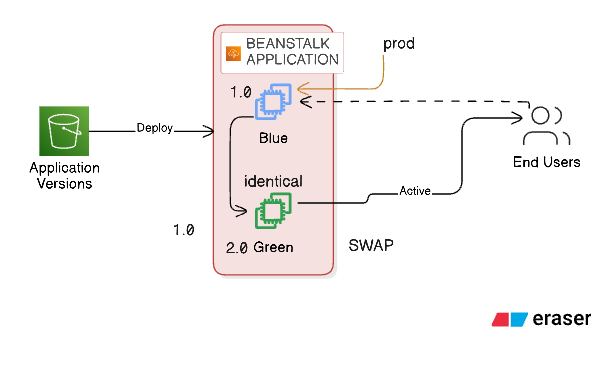

# AWS Elastic Beanstalk Blue/Green Deployment with Terraform

This project demonstrates a **Blue/Green deployment strategy** using AWS Elastic Beanstalk and Terraform. It creates two identical environments (Blue and Green) that allow for zero-downtime deployments by swapping traffic between them.

## 🏗️ Architecture Overview



```
┌─────────────────┐    ┌─────────────────┐
│  Blue Environment │    │ Green Environment│
│   (Production)    │    │   (Staging)     │
│    Version 1.0    │◄──►│   Version 2.0   │
└─────────────────┘    └─────────────────┘
         │                       │
         └───────────┬───────────┘
                     │
            ┌─────────────────┐
            │   S3 Bucket     │
            │ (App Versions)  │
            └─────────────────┘
```

## 📊 Key Features Demonstrated

- **Zero-Downtime Deployments**: Seamless traffic switching between environments
- **Infrastructure as Code**: Complete AWS infrastructure managed with Terraform
- **Automated Application Packaging**: Scripts for both Windows and Linux/Mac
- **Environment Isolation**: Separate Blue and Green environments with identical configurations
- **Version Management**: S3-based application version storage and tracking
- **Health Monitoring**: Enhanced health reporting and environment monitoring
- **Auto Scaling**: Configurable scaling policies for both environments
- **Load Balancing**: Application Load Balancer with health checks
- **IAM Security**: Least privilege access with dedicated service roles
- **Rollback Capability**: Instant rollback by swapping environments again
- **Multi-Platform Support**: Cross-platform deployment scripts
- **Comprehensive Documentation**: Step-by-step guides and troubleshooting

## 💰 Cost Considerations

### 💵 **Estimated Monthly Costs (us-east-1)**

| Resource | Configuration | Estimated Cost |
|----------|---------------|----------------|
| **EC2 Instances** | 2x t3.micro (Blue + Green) | ~$16.80/month |
| **Application Load Balancer** | 2x ALB (one per environment) | ~$32.40/month |
| **S3 Storage** | Application versions (<1GB) | ~$0.05/month |
| **Data Transfer** | Minimal for demo usage | ~$1.00/month |
| **Total Estimated** | | **~$50.25/month** |

### 💡 **Cost Optimization Strategies**

**Development/Testing:**
- Use `t3.nano` or `t3.micro` instances
- Terminate Green environment when not needed
- Use scheduled scaling to shut down during off-hours
- Consider spot instances for non-production workloads

**Production Optimization:**
- Right-size instances based on actual usage
- Implement auto-scaling policies
- Use Reserved Instances for predictable workloads
- Monitor and optimize data transfer costs
- Consider single ALB with target group switching

**Cost Monitoring:**
```bash
# Set up billing alerts
aws budgets create-budget --account-id <account-id> --budget file://budget.json

# Monitor costs by service
aws ce get-cost-and-usage --time-period Start=2024-01-01,End=2024-01-31 --granularity MONTHLY
```

**Free Tier Benefits:**
- New AWS accounts get 750 hours/month of t3.micro instances
- 5GB of S3 storage included
- 15GB of data transfer out per month

### ⚠️ **Important Cost Notes**

- **Dual Environment Cost**: Running both Blue and Green simultaneously doubles compute costs
- **Load Balancer Costs**: Each environment has its own ALB (consider shared ALB for cost savings)
- **Data Transfer**: Cross-AZ traffic incurs charges
- **Storage**: Application versions in S3 accumulate over time

### 🎯 **Cost-Effective Alternatives**

1. **Single Environment with Rolling Deployments**: Lower cost but brief downtime
2. **Shared ALB with Target Groups**: Reduce load balancer costs
3. **Container-based Deployments**: Use ECS/EKS for more efficient resource utilization
4. **Serverless Approach**: Consider Lambda + API Gateway for applicable workloads

## 📋 Prerequisites

- **AWS CLI** configured with appropriate permissions
- **Terraform** >= 1.0
- **Node.js** application (sample apps included)
- **PowerShell** (Windows) or **Bash** (Linux/Mac) for packaging scripts

## 🚀 Quick Start

### 1. Clone and Setup

```bash
git clone <repository-url>
cd <repository-url>
```

### 2. Configure Variables

Create a `terraform.tfvars` file:

```hcl
aws_region = "us-east-1"
app_name = "my-app-bluegreen"
solution_stack_name = "64bit Amazon Linux 2023 v6.7.2 running Node.js 20"
instance_type = "t3.micro"

tags = {
  Project     = "BlueGreenDeployment"
  Environment = "Demo"
  ManagedBy   = "Terraform"
  Owner       = "YourName"
}
```

### 3. Package Applications

**Windows:**
```powershell
.\package-apps.ps1
```

**Linux/Mac:**
```bash
chmod +x package-apps.sh
./package-apps.sh
```

### 4. Deploy Infrastructure

```bash
terraform init
terraform plan
terraform apply
```

## 📁 Project Structure

```
Day-17/
├── app-v1/                    # Blue environment application (v1.0)
│   ├── app.js
│   ├── package.json
│   └── app-v1.zip
├── app-v2/                    # Green environment application (v2.0)
│   ├── app.js
│   ├── package.json
│   └── app-v2.zip
├── main.tf                    # Core infrastructure (IAM, S3, EB App)
├── blue-environment.tf        # Blue environment configuration
├── green-envrionment.tf       # Green environment configuration
├── provider.tf                # AWS provider configuration
├── variables.tf               # Variable definitions
├── outputs.tf                 # Output values and instructions
├── data-sources.tf            # Data sources for solution stacks
├── package-apps.ps1           # Windows packaging script
├── package-apps.sh            # Linux/Mac packaging script
├── terraform.tfvars           # Variable values (not in git)
├── .gitignore                 # Git ignore rules
└── README.md                  # This file
```

## 🔧 Infrastructure Components

### Core Resources
- **Elastic Beanstalk Application**: Container for environments
- **S3 Bucket**: Stores application versions
- **IAM Roles**: EC2 and service roles with proper permissions

### Blue Environment (Production)
- **Environment Name**: `{app_name}-blue`
- **Version**: 1.0
- **Application**: Simple Node.js app showing "Blue Environment - Version 1.0"

### Green Environment (Staging)
- **Environment Name**: `{app_name}-green`
- **Version**: 2.0
- **Application**: Simple Node.js app showing "Green Environment - Version 2.0"

## 🔄 Blue/Green Deployment Process

### Step 1: Verify Environments

After deployment, check both environments:

```bash
# Get environment URLs
terraform output blue_environment_url
terraform output green_environment_url
```

### Step 2: Test Applications

- **Blue Environment**: Should display "Blue Environment - Version 1.0"
- **Green Environment**: Should display "Green Environment - Version 2.0"

### Step 3: Perform Environment Swap

Use the AWS CLI to swap environment CNAMEs:

```bash
# Get the swap command
terraform output swap_command

# Execute the swap
aws elasticbeanstalk swap-environment-cnames \
  --source-environment-name my-app-bluegreen-blue \
  --destination-environment-name my-app-bluegreen-green \
  --region us-east-1
```

### Step 4: Verify Swap

After the swap (takes 1-2 minutes):
- **Blue URL** now shows Version 2.0
- **Green URL** now shows Version 1.0

### Step 5: Rollback (if needed)

Simply run the same swap command again to revert!

## 📊 Monitoring and Management

### Environment Health
```bash
# Check environment health
aws elasticbeanstalk describe-environment-health \
  --environment-name my-app-bluegreen-blue \
  --attribute-names All
```

### Application Versions
```bash
# List application versions
aws elasticbeanstalk describe-application-versions \
  --application-name my-app-bluegreen
```

## 🛠️ Customization

### Adding New Application Versions

1. **Create new app folder**: `app-v3/`
2. **Update packaging scripts**: Add v3 to scripts
3. **Create new Terraform resources**: Follow blue/green pattern
4. **Deploy**: Run terraform apply

### Changing Instance Types

Update `terraform.tfvars`:
```hcl
instance_type = "t3.small"  # or any other instance type
```

### Multi-Region Deployment

1. **Add provider aliases** for different regions
2. **Duplicate environment resources** with different providers
3. **Update DNS routing** for global load balancing

## 🔒 Security Best Practices

- **IAM Roles**: Least privilege access
- **S3 Bucket**: Private with public access blocked
- **Environment Variables**: Use for sensitive configuration
- **VPC**: Deploy in private subnets (optional enhancement)

## 💰 Cost Optimization

- **Instance Types**: Use t3.micro for development
- **Auto Scaling**: Configure min/max instances appropriately
- **Scheduled Scaling**: Scale down during off-hours
- **Environment Termination**: Terminate unused environments

## 🧹 Cleanup

To destroy all resources:

```bash
terraform destroy
```

**Note**: This will delete all environments and the S3 bucket with application versions.

## 📚 Additional Resources

- [AWS Elastic Beanstalk Documentation](https://docs.aws.amazon.com/elasticbeanstalk/)
- [Blue/Green Deployment Best Practices](https://aws.amazon.com/builders-library/automating-safe-hands-off-deployments/)
- [Terraform AWS Provider](https://registry.terraform.io/providers/hashicorp/aws/latest/docs)

## 🤝 Contributing

1. Fork the repository
2. Create a feature branch
3. Make your changes
4. Test thoroughly
5. Submit a pull request

## 📄 License

This project is licensed under the MIT License - see the LICENSE file for details.

## 🆘 Troubleshooting

### Common Issues

**Solution Stack Not Found**
```bash
# Get available stacks
aws elasticbeanstalk list-available-solution-stacks \
  --query "SolutionStacks[?contains(@, 'Node.js 20')]"
```

**Application Version Upload Failed**
- Ensure packaging scripts ran successfully
- Check S3 bucket permissions
- Verify ZIP file exists in correct location

**Environment Creation Failed**
- Check IAM permissions
- Verify solution stack name
- Review CloudWatch logs

### Getting Help

- Check Terraform logs: `TF_LOG=DEBUG terraform apply`
- Review AWS CloudWatch logs
- Check Elastic Beanstalk event logs in AWS Console

---

**Happy Deploying! 🚀**